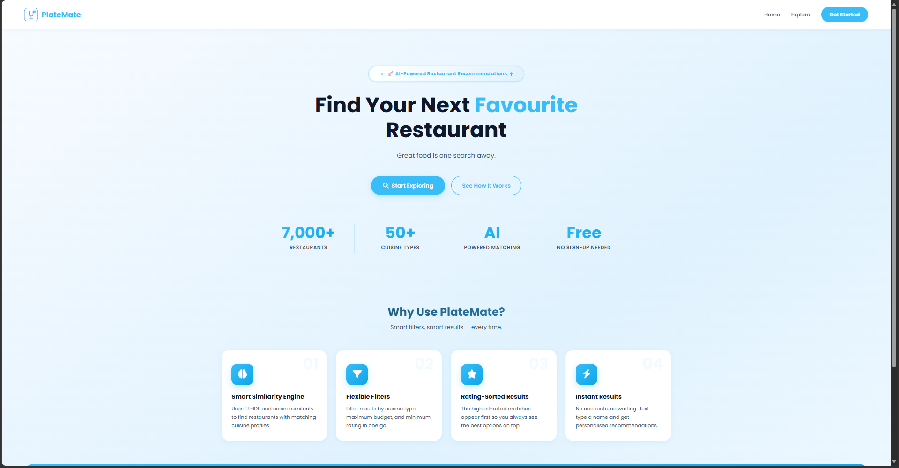
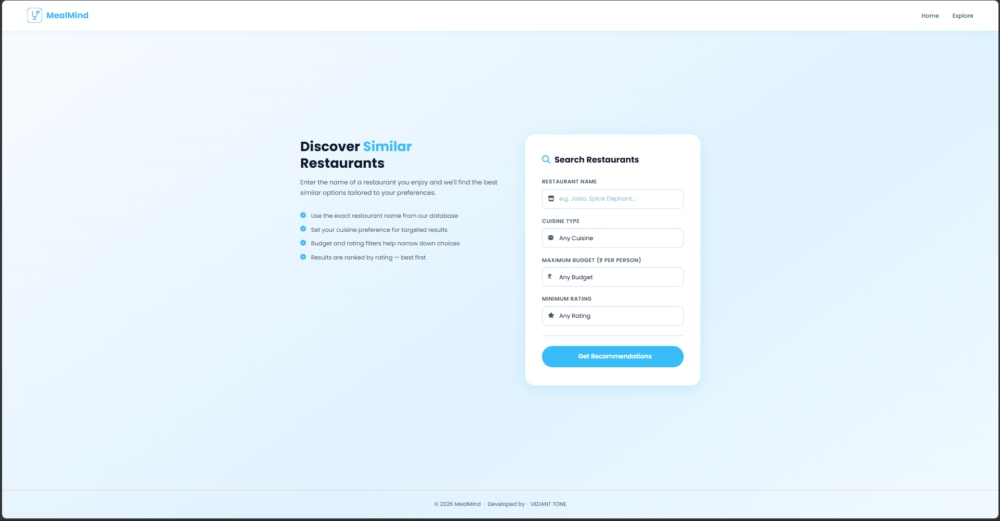
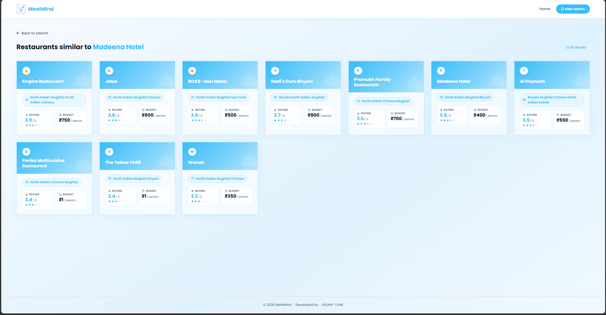
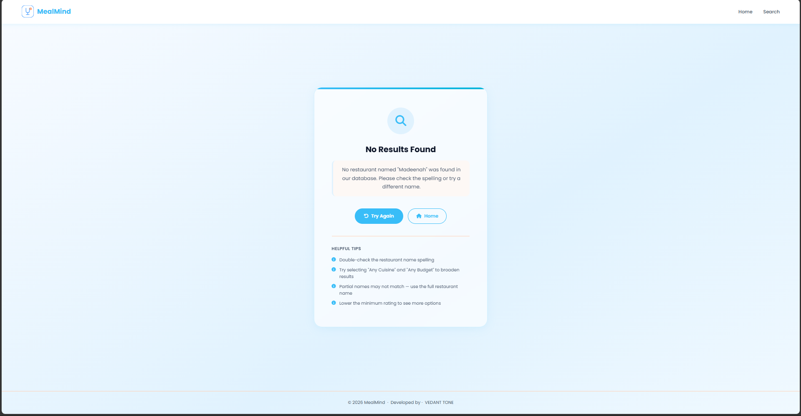

# 🍽️ Smart Restaurant Recommendation System

A web-based restaurant recommendation system that suggests restaurants based on user preferences such as cuisine, budget, and ratings using **Content-Based Filtering**.

---

## 🚀 Features

- 🔍 Search restaurants by name
- 🍜 Filter by cuisine
- 💰 Budget-based filtering
- ⭐ Rating-based filtering
- 🤖 ML-based recommendations (TF-IDF + Cosine Similarity)
- 🎨 Modern UI (Dashboard Style)
- ⚠️ Error handling (No results / Not found)

---

## 🧠 How It Works

1. User enters:
   - Restaurant Name
   - Cuisine
   - Budget
   - Rating

2. System:
   - Finds the selected restaurant
   - Converts cuisine text into vectors (TF-IDF)
   - Calculates similarity using Cosine Similarity

3. Filters results:
   - Cuisine match
   - Budget
   - Rating

4. Displays top recommended restaurants

---

## 🛠️ Tech Stack

### 💻 Frontend

- HTML
- CSS
- Font Awesome

### ⚙️ Backend

- Python
- Flask

### 📊 Data Processing

- Pandas
- NumPy

### 🤖 Machine Learning

- Scikit-learn
  - TF-IDF Vectorizer
  - Cosine Similarity

---

## 📂 Project Structure

Restaurant-Recommendation-System/
│
├── screenshots/
│ ├── form.png
│ ├── index.png
│ ├── result.png
| ├── result2.png
|
│── templates/
| │── error.html
│ │── index.html
│ │── recommend.html
│ │── result.html
│ 
│── app1.py
│── requirements.txt
|── restaurant1.csv
│
└── README.md

---

## 📸 Screenshots

### 🏠 Home Page

### 🔍 Recommendation Page

### 📊 Result Page

---

## 📊 Dataset

The dataset contains:

- Restaurant Name
- Rating
- Mean Rating
- Cuisines
- Cost

### Example:

Jalsa, North Indian, upto Rs.500, upto 3.0

---

## 📌 Conclusion

This project demonstrates how machine learning can be used to build a real-world recommendation system with a modern UI and filtering logic.

---

## 👨‍💻 Developed By

**Vedant Tone**
